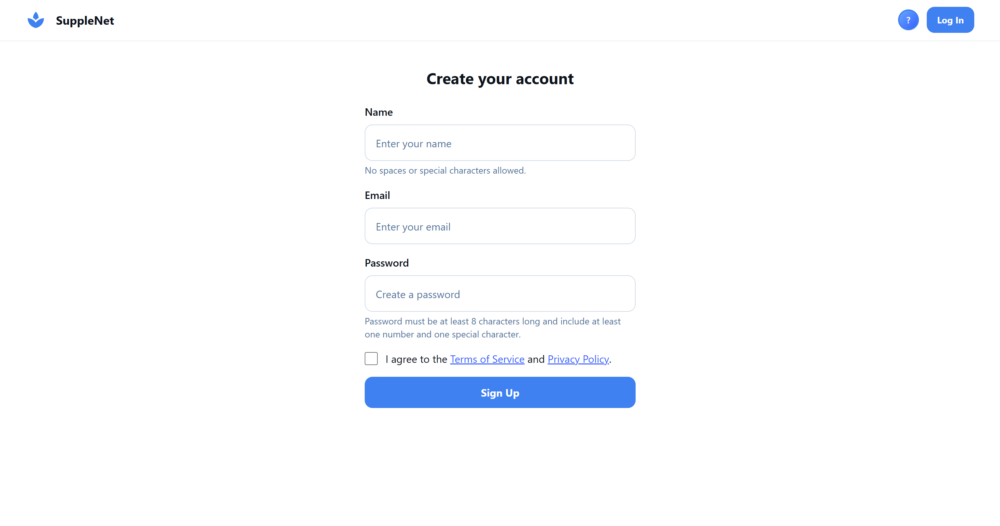
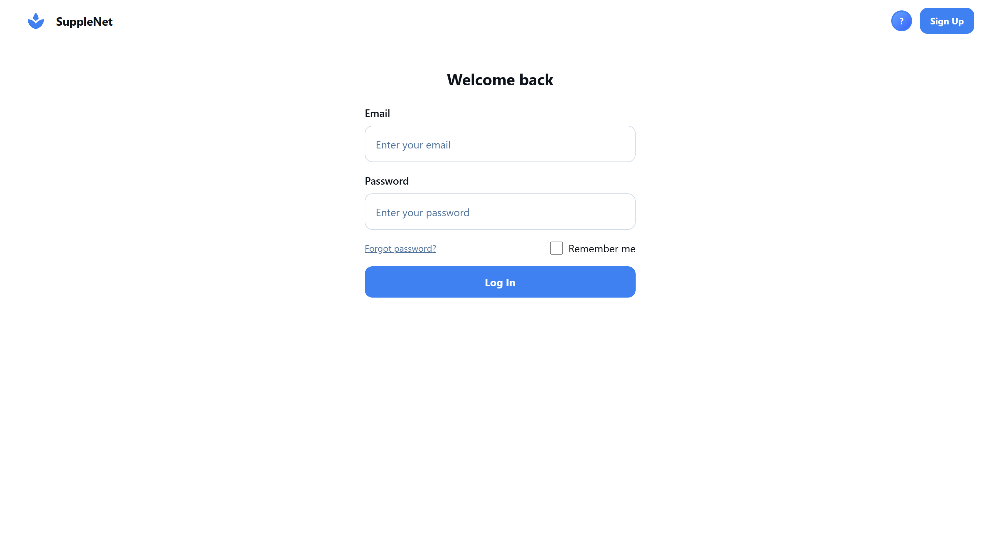
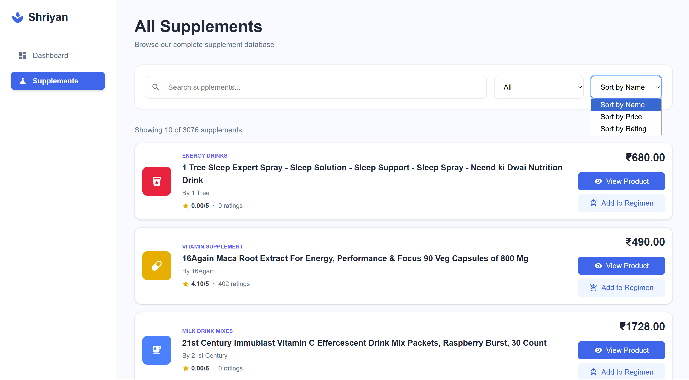

# SuppleNet - Health Supplement Recommender

A full-stack web app that recommends personalized supplements based on your health profile and goals.

## What it does

- **Smart onboarding**: Collects your health info, goals, and preferences
- **Personalized recommendations**: Shows supplements tailored to your profile  
- **Regimen management**: Add supplements to your daily routine with custom timing
- **Clean interface**: Easy to use on any device

## Tech Stack

**Backend:** Django, PostgreSQL, JWT auth  
**Frontend:** React, Tailwind CSS  
**Deployment:** Docker, Nginx  

## Quick Start

```bash
git clone https://github.com/shriyanbachigari/health-supplement-recommender.git
cd health-supplement-recommender
docker-compose up --build
```

Visit `http://localhost:3000` to try it out.

## Features

### Authentication
- Secure signup/login with JWT tokens
- Protected routes and session management

### Health Profiling  
- Multi-step onboarding wizard
- Health goals, conditions, lifestyle tracking
- Personalized recommendations based on your data

### Supplement Management
- Browse complete supplement database with search and filtering
- Pagination for performance with large datasets
- Add to personal regimen with dosage/timing
- Visual organization by time of day (morning, evening, etc.)
- Direct links to purchase products
- Category-based browsing with visual icons

## API Endpoints

```
POST /api/signup/       # User registration
POST /api/token/        # Login
GET  /api/recommend/    # Get recommendations
GET  /api/supplements/  # Browse all supplements
POST /api/regimen/      # Manage supplement regimen
GET  /api/profile/      # User profile management
```

## Screenshots

### Landing Page

*Full homepage overview - clean design with clear navigation and call-to-action (zoomed out to show complete layout)*

### Sign Up

*User registration form with clean validation*

### Login

*Secure authentication interface*

### Onboarding Wizard

*Multi-step health profile creation process*

### Dashboard

*Daily supplement schedule organized by timing along with personalized recommendations with visual category icons*

### Supplements Directory

*Complete supplement database with search, filtering, and pagination*

### Add to Regimen Modal

*Easy supplement addition with dosage and timing options*

## What I learned

- Building REST APIs with Django
- JWT authentication implementation
- React state management and routing
- Docker containerization
- Database design for user profiles and recommendations

## Future improvements

- Machine learning for better recommendations (scikit-learn)
- Supplement interaction warnings
- Progress tracking and analytics
- Mobile app

